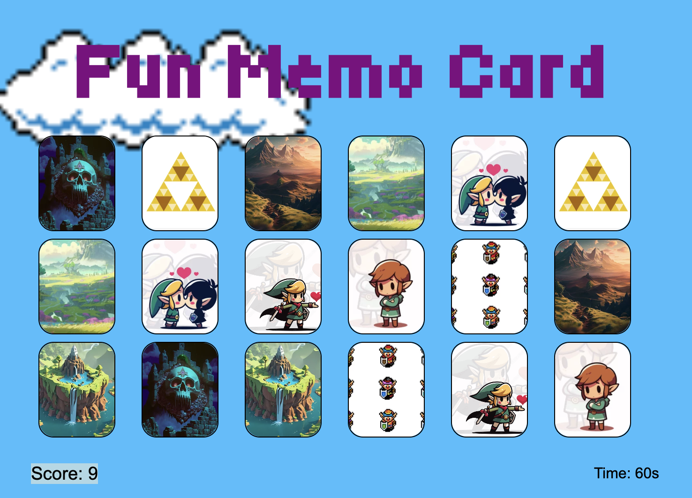

# Zee's Memory Card Game

## 

Zee's Memo Card Game is a fun and engaging memory game. It combines iconic theme like Zelda and Mario and transport players back to the 90s gaming world. It is also a challenging game to improve memory, concentration and speed skills. It works as a usual memory card game, where you have a limited amount of time to find all matching pairs. Everytime you find a matching pair, you score a point.

## Instructions:

1. Click the "Start Game" button to start playing.
2. Find all the matching pairs of cards by clicking to flip them.
3. You have 60 seconds to find all matches.
4. You get a point for each matching pair.
5. If you find all matching pair in less that 60 or 60 seconds you win!
6. If time runs out without finding all the pairs, you lose and can try again!

## Technology Used 
* HTML
* CSS
* JavaScript
* DOM

### Attributions and References:

- Instruction Page - Background Gif:
- Game Page - Background Image:
- Zelda Themed Card Images:
- Fonts: Google Fonts

### Play the Game: [Start Playing]()
[Start Playing]()

